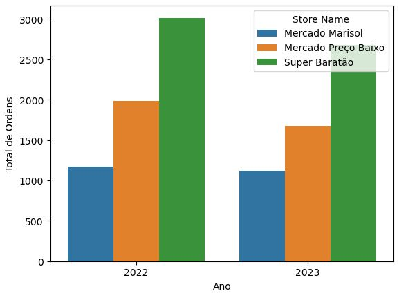

**Nome:** André Balbi Aguiar

**Tel:** (12) 9 91836414

**email:** abalbiaguiar@gmail.com

**Linkedin:** [https://www.linkedin.com/in/drebalbi/](https://www.linkedin.com/in/drebalbi/)

**Base de dados utilizada:** [https://docs.google.com/spreadsheets/d/1YXZ1dwypkI2l9klKonKQHtU0o6ywSw-Su49C97mvQLM/edit#gid=0](https://docs.google.com/spreadsheets/d/1YXZ1dwypkI2l9klKonKQHtU0o6ywSw-Su49C97mvQLM/edit#gid=0)

# **Perguntas:**

1. **Quantos pedidos - únicos - a loja Super Baratão teve no mês de Dezembro?**
    
    R: `A loja Super Baratão teve **1448** pedidos únicos em fevereiro.`
    
2. **Qual foi o mês com maior percentual de rejeição da loja Mercado Marisol?**
    
    R:`O mes com maior percentual de aprovacao foi o **12** com **99.12 %.**`
    
3. **Quantos usuários fizeram pedidos na loja Mercado Preço Baixo no mês de Dezembro?**
    
    R: `O total de usuários que fizeram pedidos na loja Mercado Preço Baixo no mês de Dezembro foi de **12**`
    
4. **Construa um gráfico (e compartilhe comigo!) com o total de pedidos de 2022 e 2023. O gráfico deve exibir o total de tarefas de cada loja individualmente.**
    
    
    

**5. Identifique o % de variação de pedidos - únicos - por loja no período ano contra ano.**

|  | Store Name | ano | Order Number | % var |
| --- | --- | --- | --- | --- |
| 0 | Mercado Marisol | 2022 | 1093 | - |
| 1 | Mercado Marisol | 2023 | 1089 | -0.365965 |
| 2 | Mercado Preço Baixo | 2022 | 1721 | - |
| 3 | Mercado Preço Baixo | 2023 | 1552 | -9.819872 |
| 4 | Super Baratão | 2022 | 2894 | - |
| 5 | Super Baratão | 2023 | 2537 | -12.335867 |
